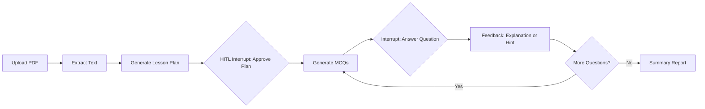
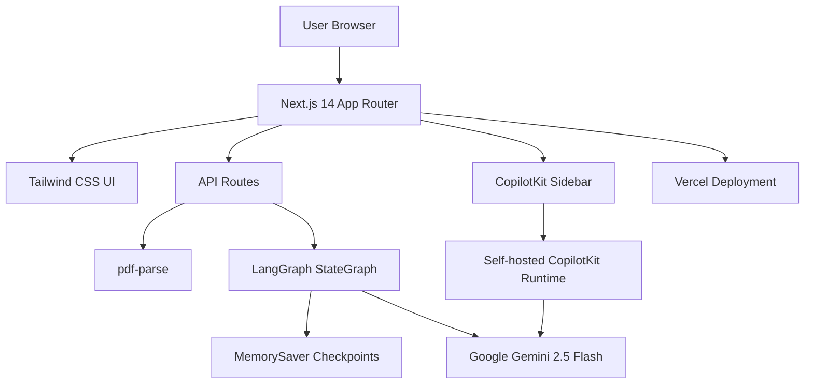
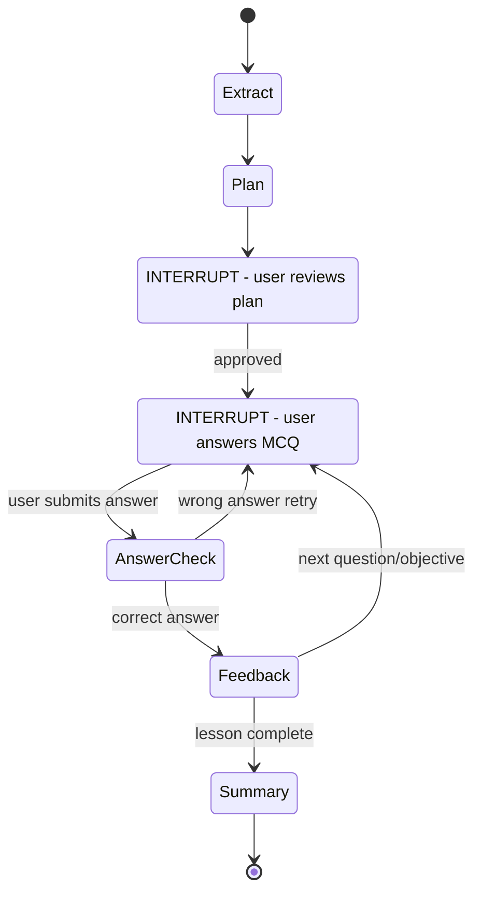

# AI Lesson Builder

An AI-powered web application that transforms any PDF into an interactive, structured lesson with MCQ quizzes, real-time feedback, an AI tutor, and a personalized performance summary.

Built as a skills assessment for Memorang.

## Live Demo

[Add your Vercel URL here after deployment]

## Features

- **PDF Upload** - Drag-drop or click to upload any PDF up to 25MB.
- **AI Lesson Plan** - Gemini 2.5 Flash analyzes the document and generates 3-5 structured learning objectives.
- **Human-in-the-Loop Review** - The learner reviews and approves the generated plan before the quiz begins.
- **Interactive MCQ Quiz** - The app generates 3 multiple-choice questions per objective from the PDF content.
- **Visual Feedback** - Correct answers show an explanation; wrong answers show a hint without revealing the answer.
- **Retry Without Penalty** - Learners can retry wrong answers until they understand the concept.
- **AI Tutor Chat** - CopilotKit powers a sidebar tutor that explains concepts and gives non-spoiler hints.
- **Performance Summary** - The final report includes score, objective breakdown, encouragement, and study tips.

## Demo Flow



## Tech Stack



| Layer | Technology | What it does in this project |
|-------|------------|------------------------------|
| Framework | Next.js 14 App Router + TypeScript | Runs the web app, API routes, routing, and typed React UI. |
| Agent Workflow | LangGraph JS | Orchestrates the lesson workflow with stateful nodes and interrupt/resume behavior. |
| Checkpointing | LangGraph MemorySaver | Stores in-memory lesson state by `thread_id` between API calls. |
| LLM | Google Gemini 2.5 Flash | Generates lesson plans, MCQs, explanations, hints, and study summaries. |
| Chat UI | CopilotKit | Provides the self-hosted AI tutor sidebar without a CopilotKit cloud key. |
| PDF Parsing | pdf-parse | Extracts text from uploaded PDFs before sending content to the agent. |
| Styling | Tailwind CSS | Implements the warm cream visual system, cards, buttons, badges, and feedback states. |
| Deployment | Vercel | Hosts the production Next.js application. |

## Architecture

The app uses a LangGraph `StateGraph` with a structured workflow and human-in-the-loop pause points.



1. **Plan Interrupt** - After generating the lesson plan, the graph pauses. The user reviews objectives and clicks **Begin Lesson** to resume.
2. **MCQ Interrupt** - Each question pauses the graph until the user submits an answer. Wrong answers retry without penalty; correct answers unlock the next step.
3. **Summary** - After all objectives are complete, Gemini generates a personalized report from the learner's answer history.

State is preserved between requests using LangGraph's `MemorySaver`, keyed by a `thread_id` stored in `sessionStorage`.

## Setup

### Prerequisites

- Node.js 18+
- A Google Gemini API key from [Google AI Studio](https://aistudio.google.com)

### Local Development

1. Clone the repository:

   ```bash
   git clone https://github.com/onen01/ai-lesson-builder.git
   cd ai-lesson-builder
   ```

2. Install dependencies:

   ```bash
   npm install
   ```

3. Create `.env.local`:

   ```bash
   GOOGLE_GENERATIVE_AI_API_KEY=your_key_here
   ```

4. Run the development server:

   ```bash
   npm run dev
   ```

5. Open [http://localhost:3000](http://localhost:3000).

## Deployment

### Vercel

1. Push the repository to GitHub.
2. Import the repository on [Vercel](https://vercel.com).
3. Add the environment variable:

   ```bash
   GOOGLE_GENERATIVE_AI_API_KEY=your_key_here
   ```

4. Deploy.

## Project Structure

```text
app/
  api/
    copilotkit/       CopilotKit runtime for the chat tutor
    lesson/           LangGraph agent executor and resume API
    upload/           PDF upload and parsing endpoint
  lesson/             Main lesson page and quiz experience
  page.tsx            Landing page with PDF upload

components/
  lesson/             Plan, MCQ, feedback, progress, and summary UI
  ui/                 Small shared UI primitives

lib/
  agent/              LangGraph graph, state, and node implementations
  utils/              PDF parsing utility
```

## Notes

- The app does not require a database for the demo flow.
- `.env.local` is ignored and must not be committed.
- The `docs/` folder contains local build prompts and project planning notes and is ignored for submission.
